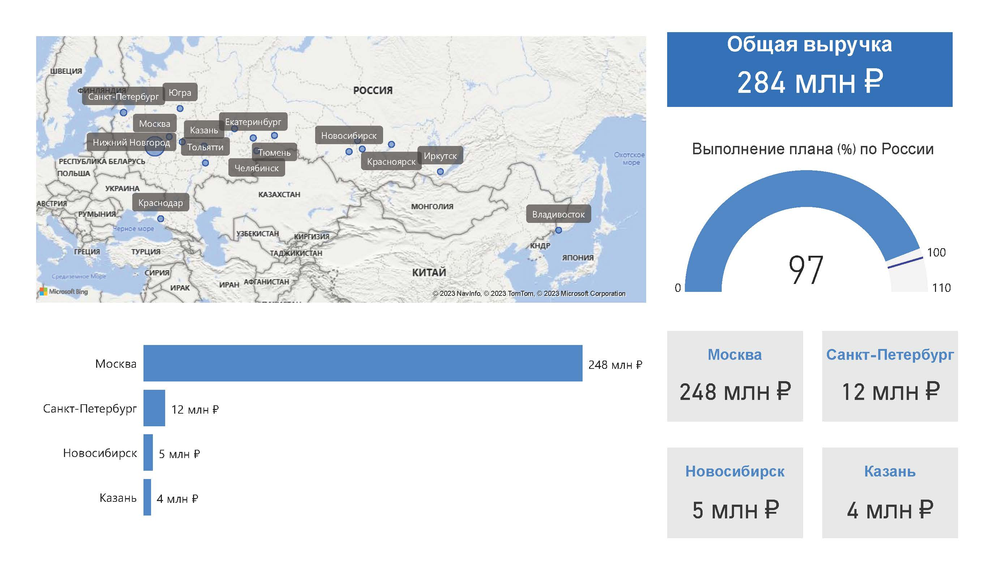

## Аналитика данных
Новосибирский областной инновационный фонд является региональным оператором Фонда «Сколково» и вплотную работает с компаниями, являющимися резидентами Фонда. Один из главных вопросов – анализ количества таких компаний, размеров их выручки, а также динамика численности персонала.

#### Данные о выручке и численности персонала за 2020-2021 гг.

    

При наведении на название компании пользователь в карточке ниже может увидеть подробную информацию о выручке и численности персонала компании.

 

Другим вопросом является распределение компаний по кластерам Сколково, ответ на вопрос – какой кластер приносит больше всего дохода.

Щелкнув правой кнопкой по интересующему столбцу, можно получить информацию о том, какие компании составляют тот или иной кластер. Так, лидером по выручке в 2021 году стали компании кластера ЭЭ (энерготех). А три наиболее крупные компании, вносящие максимальный вклад в доход кластера БМТ (Биомед) – ФЦ Знание, Биолинк, Лаборатория Ангиофарм. При наличии запроса можно более детально проанализировать каждую компанию.

Другим показателем эффективности работы организации является изучение выручки и инвестиций в проекты. 

 

Видно, что рост выручки и инвестиций в проекты «Сколково» в 2021 году по сравнению с 2020 годом составил 52 и 43% соответственно, что говорит об устойчивом развитии компании.

Одной из задач было исследование каналов связи с потенциальными заявителями. Были проанализированы данные за квартал предыдущего года.

Меньше всего лидов заключалось с веб-сайта организации и из CRM-формы «Задать вопрос». Были проанализированы причины и установлено, что сайт организации не является информативным и хорошо структурированным, CRM-форма «Задать вопрос» находилась в неочевидном для пользователя месте. Было составлено и реализовано ТЗ для реорганизации сайта.

После завершения работ рост обращений с сайта и по CRM-форме составил 57% и 64% соответственно. 

#### Дашборды

Цель информационной панели – наглядно вынести наиболее важные показатели деятельности организации, чтобы оценить, как работает компания. Некоммерческая организация фонд Сколково имеет 24 региональных представительства по России. На дашборде приведены основные показатели эффективности деятельности каждого регионального оператора - общая выручка, регионы-лидеры по выручке, процент выполнения плана.

#### Схема бизнес-процессов

При запуске конкурса субсидий Министерства образования для описания и упорядочивания работы компании было необходимо описать схему бизнес-процессов, происходящих в системе при подаче и рассмотрении заявки. Ниже приведен жизненный цикл заявки.

#### Варианты использования и пользовательские истории

